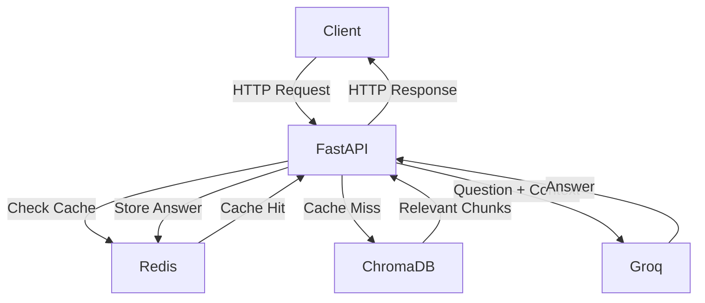

## Overview

This project is a Retrieval-Augmented Generation (RAG) API built to minimise LLM hallucinations by grounding answers strictly in uploaded documents. When a user uploads a document, it is chunked, embedded, and stored in a ChromaDB vector database. When a question is asked, the API retrieves the most semantically similar chunks and passes them as context to the LLM (via Groq), ensuring answers are based only on the provided documents and not the model's general knowledge.

Built to learn Python, FastAPI, and core RAG engineering concepts from scratch..

## Architecture

## How to Run

1. Clone the repository
   git clone https://github.com/Rububzz/rag-agent.git
   cd rag-agent

2. Create a `.env` file in the root folder with your Groq API key
   GROQ_API_KEY=your-key-here

3. Start the server
   docker compose up

4. The API will be available at http://localhost:8000
   Visit http://localhost:8000/docs for the interactive API explorer

## API Endpoints

### GET /health

Check if the server is running.

- **Returns:** `{"status": "ok", "current time": ...}`
- **Test:** `curl http://localhost:8000/health`

### POST /upload

Upload a document to the knowledge base.

- **Accepts:** `.txt` file
- **Returns:** `{"message": "Uploaded and indexed N chunks", "duration_ms": ...}`
- **Test:** `curl -X POST http://localhost:8000/upload -F "file=@sample.txt"`

### POST /query

Ask a question against uploaded documents.

- **Accepts:** `{"question": "your question here"}`
- **Returns:** `{"question": ..., "answer": ..., "chunks_used": ..., "duration_ms": ...}`
- **Note:** Returns 400 if no documents have been uploaded
- **Test:** `curl -X POST http://localhost:8000/query -H "Content-Type: application/json" -d '{"question": "How does RAG work?"}'`

## What I learnt

1. Precision vs Context
   - Precision = How much of the retrieved text is actually relevant to the user’s question?
   - Context = How much surrounding information is preserved in each chunk for the LLM to understand the answer
2. How chunking affects precision and context
   - **Small**: More precise but loses context
   - **Big**: More context but precision suffers
3. Vector Database Querying
   - How embedding creates vectors and the database is able to find semantically similar embedded text to return as context
4. Query phrasing affects retrieval quality
   - When "How does RAG work?" returned photosynthesis as the second result but the longer query returned correct results
5. Error handling matters
   - When ChromaDB was empty the LLM hallucinated a confident answer instead of saying it didn't know, which is why validation is critical in RAG systems

## Benchmarks

### Chunk Size

| Chunk Size | Score | Pass Rate |
| ---------- | ----- | --------- |
| 50 words   | 12/20 | 60%       |
| 100 words  | 15/20 | 75%       |
| 200 words  | 15/20 | 75%       |

Benchmarking across chunk sizes showed that 50-word chunks degraded performance by 15% compared to larger sizes. Chunk sizes 100 and 200 performed equally at 75%, suggesting diminishing returns beyond 100 words for this document. The 5 remaining failures were consistent across all chunk sizes, indicating retrieval limitations rather than chunk size issues. Default chunk size set to 100 words.

### Top-K Retrieval

| Top-K | Score | Pass Rate |
| ----- | ----- | --------- |
| k=1   | 13/20 | 65%       |
| k=2   | 17/20 | 85%       |
| k=3   | 16/20 | 80%       |
| k=5   | 17/20 | 85%       |

k=2 is the optimal value — matches k=5 performance at 85% while using less context, resulting in lower latency and fewer tokens. k=1 is insufficient context at 65%. Default set to k=2.

### Query Phrasing

| Question                    | Short | Medium | Descriptive |
| --------------------------- | ----- | ------ | ----------- |
| Q4 — gynoecium function     | ✓     | ✓      | ✗           |
| Q8 — ABC model              | ✗     | ✗      | ✓           |
| Q12 — petals in pollination | ✗     | ✓      | ✓           |
| Q15 — fertilisation         | ✗     | ✗      | ✗           |
| Q16 — ovary structures      | ✗     | ✓      | ✗           |

Query phrasing significantly affects retrieval quality. Longer queries don't always improve results — Q4 showed that over-specifying degraded retrieval. Q15 failed across all phrasings, indicating a genuine retrieval gap where the relevant chunk is not being retrieved regardless of query formulation. Optimal phrasing depends on document structure and embedding model behaviour.

### Redis Caching

| Query Type     | Average Latency |
| -------------- | --------------- |
| Uncached (LLM) | ~1885ms         |
| Cached         | ~1ms            |

Implemented Redis caching to store LLM responses. Cache is invalidated on every document upload or delete, ensuring answers always reflect the current document. Repeated queries are served from cache at ~1ms vs ~1885ms uncached — a 99.9% latency reduction.
