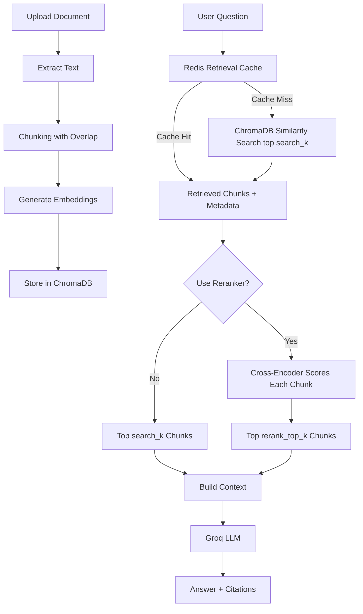

# RAG Agent

A Retrieval-Augmented Generation (RAG) system built with FastAPI, ChromaDB, Redis, and SentenceTransformers for grounded document question answering.

The project focuses on retrieval quality, evaluation, and engineering tradeoffs in RAG systems. It includes automated benchmarking for answer accuracy, retrieval hit rate, latency, token usage, and query phrasing robustness.

---

## Features

- PDF and text document ingestion
- Overlap-aware chunking
- SentenceTransformer embeddings (`all-MiniLM-L6-v2`)
- Persistent ChromaDB vector storage
- Redis retrieval-context caching
- Source citations with chunk metadata
- Retrieval-only inspection endpoint
- Automated evaluation pipeline
- Retrieval hit rate benchmarking
- Query phrasing robustness evaluation
- Latency and token usage tracking
- Dockerized local development setup

---

## Architecture



---

## Evaluation Pipeline

The system includes an automated evaluation pipeline measuring:

- Answer keyword accuracy
- Retrieval hit rate
- Query phrasing robustness
- Average latency
- Average token usage

### Retrieval Hit Rate

Retrieval hit rate measures whether the retriever successfully returned the expected evidence chunk for a question.

This separates:

- retrieval failures
- generation failures
- evaluation strictness issues

For example:

- If retrieval hit rate is high but answer accuracy is low, the issue is likely generation or evaluation wording.
- If retrieval hit rate is low, the issue is likely retrieval quality, chunking, or search configuration.

---

## Current Benchmark Results

### Chunk Size Evaluation

Average over 3 runs.

| Chunk Size | Avg Score | Avg Pass Rate |
| ---------- | --------- | ------------- |
| 50 words   | 14/20     | 70%           |
| 100 words  | 15.3/20   | 77%           |
| 200 words  | 15/20     | 75%           |

Smaller chunks improved precision but often lost important context. Larger chunks preserved context but occasionally reduced retrieval specificity.

---

### Top-K Retrieval Evaluation

| Top-K | Score | Pass Rate | Retrieval Hit Rate | Avg Latency | Avg Tokens |
| ----- | ----- | --------- | ------------------ | ----------- | ---------- |
| k=1   | 13/20 | 65%       | —                  | —           | —          |
| k=2   | 18/20 | 90%       | 88%                | 963ms       | 785        |
| k=3   | 16/20 | 80%       | —                  | —           | —          |
| k=5   | 17/20 | 85%       | 100%               | 6029ms      | 1788       |

`k=2` gave the best balance of accuracy, latency, and token usage. Increasing to `k=5`
achieved 100% retrieval hit rate but caused a 6× latency increase and more than doubled
token usage — a significant efficiency tradeoff.

---

### Retrieval Configuration Benchmarks

| Config                 | search_k | chunks_to_LLM | Pass Rate | Hit Rate | Precision@K | MRR  | Avg Latency | Avg Tokens |
| ---------------------- | -------- | ------------- | --------- | -------- | ----------- | ---- | ----------- | ---------- |
| No rerank              | 2        | 2             | 70%       | 88%      | 0.50        | 0.81 | 1007ms      | 789        |
| Rerank (10→2)          | 10       | 2             | 85%       | 88%      | 0.44        | 0.81 | 1195ms      | 770        |
| Rerank + Query Rewrite | 10       | 2             | 75%       | 88%      | 0.44        | 0.81 | 4863ms      | 796        |
| Rerank + Hybrid Search | 10       | 2             | 80%       | 88%      | 0.44        | 0.81 | 2491ms      | 765        |

Reranking improved pass rate by 15 percentage points over the baseline with only ~200ms latency increase.

Query rewriting matched reranking at 85% but tripled latency due to the extra LLM call for generating alternative phrasings. No accuracy gain over reranking alone.
Query rewriting was subsequently improved to generate diverse query types (semantic paraphrase, keyword-focused, broader context, technical terminology) instead of simple paraphrases, averaging ~83% across runs — no consistent improvement over reranking alone.

Hybrid BM25 + dense search scored 80% — below reranking alone. Retrieval hit rate remained at 88% across all configs, indicating retrieval is not the bottleneck. Remaining failures are generation phrasing issues.

Hybrid search would likely show stronger gains on documents with exact technical terms, acronyms, or product names where BM25 keyword matching outperforms dense semantic search.

**Best config for this dataset:** Rerank (10→2) — highest accuracy with acceptable latency.

## Key Findings

**Reranking is the highest-value improvement.**
Adding a cross-encoder reranker improved pass rate by 15 percentage points (70% → 85%)
with only ~200ms latency increase. It is the best tradeoff of accuracy vs cost in this pipeline.

**Retrieval is not the bottleneck.**
Retrieval hit rate, Precision@K, and MRR are identical across all configurations at 88%,
0.44, and 0.81 respectively. Adding query rewriting and hybrid search did not improve
retrieval quality — the correct chunks were already being found.

**Remaining failures are generation issues.**
Q15 and Q16 fail persistently across every configuration. The correct chunk is retrieved
and ranked highly (MRR=0.81) but the LLM omits specific expected keywords. This is an
evaluation strictness issue — keyword matching cannot detect semantically correct answers.

**More complexity does not mean better results.**
Query rewriting and hybrid search added significant latency (3-4x) without accuracy gains
on this dataset. Both would likely show stronger gains on documents with technical jargon,
acronyms, or exact terminology where semantic search alone struggles.

**LLM-as-a-judge would improve evaluation accuracy.**
Keyword matching produces false negatives on semantically correct answers. Replacing it
with an LLM-based evaluator is the highest-value next improvement.

---

### Retrieval Evaluation

| Metric             | Result                      |
| ------------------ | --------------------------- |
| Retrieval Hit Rate | 100% (5 labelled questions) |

The retrieval evaluation compares retrieved chunk indices against manually labelled evidence chunks.

Example:

```json
{
  "question": "What is pollination?",
  "expected_chunks": [21]
}
```

This allows retrieval quality to be evaluated independently from generation quality.

---

### Query Phrasing Robustness

| Question                    | Short | Medium | Descriptive |
| --------------------------- | ----- | ------ | ----------- |
| Q4 — gynoecium function     | ✓     | ✓      | ✗           |
| Q8 — ABC model              | ✗     | ✗      | ✓           |
| Q12 — petals in pollination | ✗     | ✓      | ✓           |
| Q15 — fertilisation         | ✗     | ✗      | ✗           |
| Q16 — ovary structures      | ✗     | ✓      | ✗           |

Query phrasing significantly affected retrieval quality.

Some questions improved with additional context, while others degraded when over-specified.

Q15 initially failed because the correct fertilisation chunk was not retrieved at low `top_k` values. Increasing `top_k` improved retrieval quality but increased latency and token usage.

---

### Redis Retrieval Cache

| Query Type               | Average Latency         |
| ------------------------ | ----------------------- |
| Uncached Retrieval + LLM | ~1885ms                 |
| Cached Retrieval Context | ~1ms retrieval overhead |

Redis is used to cache retrieved context and metadata.

This preserves:

- citations
- retrieval provenance
- chunk metadata

while avoiding repeated vector retrieval work.

The cache is invalidated whenever documents are uploaded or deleted.

---

## Retrieval-Only Endpoint

The project includes a retrieval-only endpoint:

```http
POST /retrieve
```

This endpoint returns:

- retrieved chunks
- source metadata
- chunk indices

without calling the LLM.

This allows retrieval debugging and evaluation without consuming LLM tokens.

Example:

```json
{
  "question": "What is pollination?",
  "sources": [
    {
      "filename": "Flower - Wikipedia.pdf",
      "chunk_index": 21,
      "text": "...",
      "preview": "Inside the Flower ..."
    }
  ]
}
```

---

## Failure Analysis

### Failure Categories

| Question                       | Missing Keywords         | Failure Type                           |
| ------------------------------ | ------------------------ | -------------------------------------- |
| Q3 — cross vs self-pollination | `same flower`            | Selection failure (fixed by reranking) |
| Q13 — biotic vs abiotic        | `wind`, `water`          | Selection failure (fixed by reranking) |
| Q17 — seed dispersal           | `competition`, `coloniz` | Selection failure (fixed by reranking) |
| Q15 — fertilisation            | `egg`                    | Generation failure (persistent)        |
| Q16 — ovary structures         | `fruit`                  | Generation failure (persistent)        |

**Selection failures** — the correct chunk existed in the top-10 candidates but wasn't ranked
in the final top-2 without reranking. Reranking fixed these by selecting better chunks from
the wider pool.

**Generation failures** — the correct chunk was retrieved and selected in all configs, but the
LLM answered correctly in meaning while omitting the specific keyword the evaluator expected.
Q15 and Q16 are persistent across every configuration tested.

---

## What I Learned

### Precision vs Context

- Precision = how much retrieved text is actually relevant to the question
- Context = how much surrounding information is preserved for the LLM

### Chunk Size Tradeoffs

- Smaller chunks improve precision but lose context
- Larger chunks preserve context but may reduce retrieval specificity

### Query Phrasing Affects Retrieval

Semantically similar questions can retrieve different chunks depending on wording and embedding behavior.

### Retrieval and Generation Should Be Evaluated Separately

A correct retrieval result can still produce a failed answer due to:

- generation issues
- evaluation strictness
- missing keywords

### Retrieval Caching Architecture Matters

Caching retrieval context instead of final answers preserves:

- citations
- metadata
- retrieval provenance

while still avoiding repeated vector search work.

---

## Running the Project

### Clone the repository

```bash
git clone https://github.com/Rububzz/rag-agent.git
cd rag-agent
```

### Create `.env`

```env
GROQ_API_KEY=your-key-here
```

### Start the application

```bash
docker compose up
```

The API will be available at:

```text
http://localhost:8000
```

Interactive API docs:

```text
http://localhost:8000/docs
```

---

## API Endpoints

### `GET /health`

Check whether the API is running.

---

### `POST /upload`

Upload a document into the vector database.

Supports:

- `.txt`
- `.pdf`

Returns:

- indexed chunk count
- upload duration

---

### `POST /query`

Ask questions against uploaded documents.

Returns:

- generated answer
- retrieved chunks
- source citations
- latency
- token usage

---

### `POST /retrieve`

Retrieval-only endpoint.

Returns retrieved chunks and metadata without calling the LLM.

Useful for:

- retrieval debugging
- evaluation
- failure analysis
- retrieval benchmarking

---

## Future Improvements

- Query rewriting — implemented and benchmarked; did not improve accuracy beyond reranking alone on current dataset
- Hybrid BM25 + dense vector retrieval — implemented and benchmarked; did not improve accuracy beyond reranking alone on current dataset
- LLM-as-a-judge evaluation (replace keyword matching)
- Retrieval confidence scoring via reranker scores
- Streaming responses
- Multi-document retrieval filtering
- Retrieval dashboards and experiment tracking
